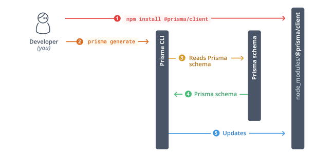

:PROPERTIES:
:ID:       af357ef1-e97a-4eb5-a6e2-bf8069d5b08c
:END:
#+title: Getting Started with Prisma

* Start from scratch

Learn how to create a new Node.js or TypeScript project from scratch by connecting Prisma to your database and generating a Prisma Client for database access. The following tutorial introduces you to the _Prisma CLI_, _Prisma Client_, and _Prisma Migrate_.

** Prerequisites

In order to successfully complete this guide, you need:

- =Node.js= installed on your machine
- a =PostgreSQL= database server running

Make sure you have your database _connection URL_ at hand.

** Create a project setup

As a first step, create a project directory and navigate into it.

#+begin_src sh

  mkdir hello-prisma
  cd hello-prisma

#+end_src

Next, initialize a TypeScript project and add the Prisma CLI as a development dependency to it:

#+begin_src sh

  npm init -y
  npm install prisma typescript ts-node @types/node --save-dev

#+end_src

This creates a =package.json= with an initial setup for your TypeScript app.

Next, initialize TypeScript:

#+begin_src sh

  npx tsc --init

#+end_src

You can now invoke the Prisma CLI by prefixing it with =npx=:

#+begin_src sh

  npx prisma

#+end_src

Next, set up your Prisma project by creating your _Prisma schema_ file with the following command:

#+begin_src sh

  npx prisma init

#+end_src

This command does two things:

- creates a new directory called =prisma= that contains a file called =schema.prisma=, which contains the Prisma schema with your database connection variable and schema models

- creates the =.env= file in the root directory of the project, which is used for defining environment variables (such as your database connection)

* Quickstart

If you follow the [[file:~/notes/til/full-stack/guide.org][guide]] do the following instead:

#+begin_src sh

  yarn add prisma typescript ts-node @types/node --save-dev
  yarn prisma init

#+end_src

* Connect your database

I assume that you use railway so copy the url of railway and paste it to =.env= file.

* Using Prisma Migrate
** Creating the database schema

In this guide, you'll use _Prisma Migrate_ to create the tables in your database. Add the following Prisma data model to your Prisma schema in =prisma/schema.prisma=:

#+begin_src prisma

  model Post {
    id        Int      @id @default(autoincrement())
    createdAt DateTime @default(now())
    updatedAt DateTime @updatedAt
    title     String   @db.VarChar(255)
    content   String?
    published Boolean  @default(false)
    author    User     @relation(fields: [authorId], references: [id])
    authorId  Int
  }

  model Profile {
    id     Int     @id @default(autoincrement())
    bio    String?
    user   User    @relation(fields: [userId], references: [id])
    userId Int     @unique
  }

  model User {
    id      Int      @id @default(autoincrement())
    email   String   @unique
    name    String?
    posts   Post[]
    profile Profile?
  }

#+end_src

To map your data model to the database schema, you need to use the =prisma migrate= CLI commands:

#+begin_src sh

  yarn prisma migrate dev --name init

#+end_src

This command does two things:

1. It creates a new SQL migration file for this migration
2. It runs the SQL migration file against the database

*NOTE*: =generate= is called under the hood by default, after running =prisma migrate dev=. If the =prisma-client-js= generator is defined in your schema, this will check if =@prisma/client= is installed and install it if it's missing.

Great, you now created three tables in your database with Prisma Migrate.

#+begin_src sql

  CREATE TABLE "Post" (
    "id" SERIAL,
    "createdAt" TIMESTAMP(3) NOT NULL DEFAULT CURRENT_TIMESTAMP,
    "updatedAt" TIMESTAMP(3) NOT NULL,
    "title" VARCHAR(255) NOT NULL,
    "content" TEXT,
    "published" BOOLEAN NOT NULL DEFAULT false,
    "authorId" INTEGER NOT NULL,
    PRIMARY KEY ("id")
  );

  CREATE TABLE "Profile" (
    "id" SERIAL,
    "bio" TEXT,
    "userId" INTEGER NOT NULL,
    PRIMARY KEY ("id")
  );

  CREATE TABLE "User" (
    "id" SERIAL,
    "email" TEXT NOT NULL,
    "name" TEXT,
    PRIMARY KEY ("id")
  );

  CREATE UNIQUE INDEX "Profile.userId_unique" ON "Profile"("userId");
  CREATE UNIQUE INDEX "User.email_unique" ON "User"("email");
  ALTER TABLE "Post" ADD FOREIGN KEY("authorId")REFERENCES "User"("id") ON DELETE CASCADE ON UPDATE CASCADE;
  ALTER TABLE "Profile" ADD FOREIGN KEY("userId")REFERENCES "User"("id") ON DELETE CASCADE ON UPDATE CASCADE;

#+end_src

* Install Prisma Client
** Install and generate Prisma Client

To get started with Prisma Client, you need to install the =@prisma/client= package:

#+begin_src sh

  yarn add @prisma/client

#+end_src

Notice that the install command automatically invokes =prisma generate= for you which reads your Prisma schema and generates a version of Prisma Client that is /tailored/ to your models.

When you make changes to your Prisma schema in the future, you manually need to invoke =prisma generate= in order to accomodate the changes in your Prisma Client API.

** client.js

Don't forget to paste this code in =prisma/= directory and named it to =client.js=.

#+begin_src js

  import { PrismaClient } from "@prisma/client"

  const client = globalThis.prisma || new PrismaClient()
  if (process.env.NODE_ENV !== "production") globalThis.prisma = client

  export default client

#+end_src

** client.tsx

#+begin_src typescript

  import { PrismaClient } from '@prisma/client'

  declare global {
    namespace NodeJS {
      interface Global {}
    }
  }

  // add prisma to the NodeJS global type
  interface CustomNodeJsGlobal extends NodeJS.Global {
    prisma: PrismaClient
  }

  // prevent multiple instances of Prisma Client in development
  declare const global: CustomNodeJsGlobal

  const prisma = global.prisma || new PrismaClient()

  if (process.env.NODE_ENV === 'development') global.prisma = prisma

  export default prisma

#+end_src
